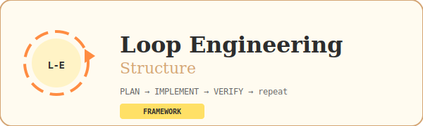
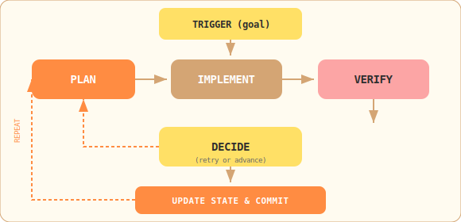
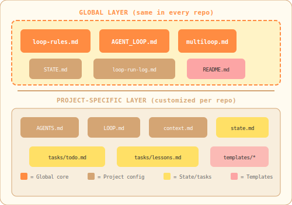
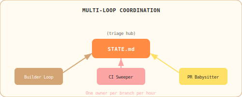

<div align="center">



<br/>

**A reusable loop engineering framework for AI coding agents.**

Drop these files into any repo → get structured, autonomous PLAN → IMPLEMENT → VERIFY loops.

<br/>

[](https://github.com/shivamsingh-007/loop-engineering-stucture)
[](#license)

</div>

---

## What Is This?

Loop engineering is a pattern where AI coding agents work in **small, verifiable steps** instead of trying to do everything at once. The agent:

1. **Plans** one step (small, testable, with clear success criteria)
2. **Implements** the code changes
3. **Verifies** the result (internal checks + external verifier)
4. **Decides** to retry or advance to the next step
5. **Updates** state and commits
6. **Repeats** until the goal is achieved

This framework gives you the rules, algorithms, coordination logic, and templates to set this up in **any project** — frontend, backend, data, infra, mobile, CLI.

---

## The Loop Flow



---

## File Roles

### Global Core (copy as-is to any repo)

These files are **project-agnostic** — they work the same everywhere:

| File | Role | Reusable? |
|------|------|-----------|
| `loop-rules.md` | Global constitution — non-negotiable rules for all agents | ✅ Same in every repo |
| `AGENT_LOOP.md` | Execution algorithm — the loop phases and logic | ✅ Same in every repo |
| `multiloop.md` | Multi-loop coordination — priorities, collision detection | ✅ Same in every repo |
| `STATE.md` | Global triage — cross-loop priorities and human inbox | ✅ Same structure |
| `loop-run-log.md` | Append-only run history — observability | ✅ Same format |

### Project-Specific (instantiate from templates)

These files get **customized** for each project:

| File | Role | Reusable? |
|------|------|-----------|
| `AGENTS.md` | Agent config — verifier setup, tech stack, commands | ❌ Project-specific |
| `LOOP.md` | Loop definitions — step breakdown, cadence | ❌ Project-specific |
| `context.md` | Project description — goals, architecture, conventions | ❌ Project-specific |
| `state.md` | Per-loop state — current step, attempts, log | ❌ Project-specific |
| `tasks/todo.md` | Task board — checkable items with success criteria | ❌ Project-specific |
| `tasks/lessons.md` | Self-improvement — mistake patterns | ❌ Project-specific |

---

## Architecture



---

## How to Port to a New Repo

### Step 1: Copy Global Files

Copy these 5 files to your target repo root:

```
loop-rules.md
AGENT_LOOP.md
multiloop.md
STATE.md
loop-run-log.md
```

### Step 2: Instantiate Templates

Fill in project-specific content:

```
templates/AGENTS.md.template        →  AGENTS.md
templates/LOOP.md.template          →  LOOP.md
templates/context.md.template       →  context.md
templates/state.md.template         →  state.md
templates/loop-run-log.md.template  →  loop-run-log.md
templates/tasks/todo.md.template    →  tasks/todo.md
templates/tasks/lessons.md.template →  tasks/lessons.md
```

### Step 3: Configure Your Verifier

In `AGENTS.md`, fill in:
- Provider/model for external verification
- API key environment variable
- Project-specific verification checks

### Step 4: Define Your Steps

In `LOOP.md`, define:
- What steps make up your project
- Success criteria for each step
- Commands to run for verification

### Step 5: Start the Loop

1. Give the agent a **GOAL**
2. Agent reads `loop-rules.md` and all context files
3. Agent plans the first step
4. Agent implements, verifies, and commits
5. Repeat until done

---

## Multi-Loop Coordination



When running multiple loops:

- Each loop has its own state file
- `STATE.md` is the shared triage hub
- `loop-run-log.md` records all activity
- Collision detection uses `acting_on` markers
- Priority ordering prevents conflicts

See `multiloop.md` for full coordination rules.

---

## Example

The `examples/anime-comic-site/` directory shows this framework applied to a real project:

| File | What it shows |
|------|---------------|
| `AGENTS.md` | Configured for a Spider-Man 3D demo site |
| `state.md` | 9 completed steps with full log |
| `tasks/todo.md` | Real task board with success criteria |
| `tasks/lessons.md` | 5 lessons learned during development |

Use it as a reference when setting up your own project.

---

## Quickstart

```bash
# 1. Clone this repo
git clone https://github.com/shivamsingh-007/loop-engineering-stucture.git

# 2. Copy global files to your project
cp loop-engineering-stucture/loop-rules.md your-project/
cp loop-engineering-stucture/AGENT_LOOP.md your-project/
cp loop-engineering-stucture/multiloop.md your-project/
cp loop-engineering-stucture/STATE.md your-project/
cp loop-engineering-stucture/loop-run-log.md your-project/

# 3. Copy and customize templates
cp loop-engineering-stucture/templates/AGENTS.md.template your-project/AGENTS.md
cp loop-engineering-stucture/templates/LOOP.md.template your-project/LOOP.md
cp loop-engineering-stucture/templates/context.md.template your-project/context.md
cp loop-engineering-stucture/templates/state.md.template your-project/state.md

# 4. Set up tasks directory
mkdir -p your-project/tasks
cp loop-engineering-stucture/templates/tasks/todo.md.template your-project/tasks/todo.md
cp loop-engineering-stucture/templates/tasks/lessons.md.template your-project/tasks/lessons.md

# 5. Edit AGENTS.md → configure your verifier
# 6. Edit LOOP.md → define your steps
# 7. Edit context.md → describe your project
# 8. Give your agent a GOAL and watch it loop
```

---

## License

This framework is provided as-is. Use it in any project.
